# Architecture — Live Sermon Translator

*Last updated: 2026-07-13 (seven target languages; translation is
demand-driven — only languages some viewer selected are processed)*

A live translation pipeline: English speech goes in from one host, and English
transcripts, translations, and TTS audio come out to any number of viewers —
all three aligned per sentence. Each viewer subscribes to one target language:

| Code  | Language | Verse quotations from | TTS voice (default) |
| ----- | -------- | --------------------- | ------------------- |
| `ko`  | Korean | 개역개정 | `ko-KR-Neural2-C` |
| `zh`  | Mandarin (Simplified) | 和合本 (简体, 神版) | `cmn-CN-Chirp3-HD-Charon` |
| `yue` | Cantonese (Traditional, HK) | 和合本 (繁體, 神版) | `yue-HK-Chirp3-HD-Charon` |
| `fa`  | Farsi | هزارهٔ نو (New Millennium) | — text-only (no Cloud TTS voice) |
| `pa`  | Punjabi (Gurmukhi) | ਪਵਿੱਤਰ ਬਾਈਬਲ (BSI) | `pa-IN-Chirp3-HD-Charon` |
| `es`  | Spanish (Latin American) | Reina-Valera 1960 | `es-US-Chirp3-HD-Charon` |
| `fr`  | French | Louis Segond 1910 | `fr-FR-Chirp3-HD-Charon` |

> **Note:** `CLAUDE.md` describes a Gemini **Live API** speech-to-speech relay
> architecture (no STT stage, no segmenter, no separate translation call), but the
> actual code is the older pipeline architecture — Deepgram STT → sentence
> segmenter → Gemini text translation. The code and the project doc have diverged;
> this document describes the code.

## Big picture

One FastAPI server (`server/main.py`) sits in the middle. A single "host" (the
person at the preacher's microphone) streams raw audio to it over a WebSocket.
The server transcribes that audio with Deepgram, cuts the transcript into
sentences, translates each sentence with Gemini, synthesizes each translation
into speech with Cloud TTS, and broadcasts the results as JSON messages to the
clients in the same room. Clients are purely passive — they open a WebSocket
with a `?lang=` parameter, receive text and audio for that language only
(`transcript` messages go to everyone), and render/play it.

Translation is **demand-driven**: per sentence, the worker processes only the
languages that at least one connected viewer has selected (`Room.wanted_langs()`;
`lang=all` monitor sockets don't create demand), so an idle language costs
nothing. Demanded languages run concurrently per sentence; a failure in one
never costs the others their output. Languages without a Cloud TTS voice
(currently Farsi) get translations but no `tts` messages.

**Alignment model:** the segmented sentence is the unit of everything. Each
sentence gets an incrementing `id` when it leaves the segmenter, and the
`transcript`, `translation`, and `tts` messages for that sentence all carry it,
so clients pair the three streams explicitly (the browser client highlights the
sentence whose audio is currently playing).

## Diagram

```mermaid
flowchart LR
    subgraph Host
        MIC["Browser host (client/host.html)<br/>AudioWorklet → 16 kHz mono PCM,<br/>100 ms chunks<br/>(or mic_test.py stand-in)"]
    end

    subgraph Server["FastAPI server (server/main.py)"]
        WSH["WS /ws/host<br/>one host per room"]
        STT["DeepgramTranscriber<br/>(stt.py)<br/>nova-3, smart_format"]
        SEG["SentenceSegmenter<br/>(segmenter.py)<br/>split on . ? !"]
        Q["asyncio.Queue<br/>(preserves order)"]
        TR["Translator ×N (translator.py)<br/>gemini-3.1-flash-lite<br/>+ per-language glossary prompt<br/>(glossary.py, demanded langs only)"]
        TTS["Synthesizer ×N (tts.py)<br/>Google Cloud TTS<br/>24 kHz PCM out"]
        ROOM["Room.broadcast<br/>(rooms.py)<br/>lang-targeted"]
        WSC["WS /ws/client?lang=ko|zh<br/>receive-only"]
    end

    subgraph Clients["N passive clients"]
        WEB["Browser feed + audio<br/>(client/index.html)"]
        CLI["Terminal viewer<br/>(listen_test.py)"]
    end

    MIC -- "binary audio frames" --> WSH
    WSH -- "raw PCM (untouched)" --> STT
    STT -- "final transcripts" --> SEG
    SEG -- "sentences (each gets an id)<br/>{type: transcript, id}" --> Q
    SEG -.-> ROOM
    Q --> TR
    TR -- "{type: translation,<br/>id, source, text}" --> ROOM
    TR -- "Korean text" --> TTS
    TTS -- "{type: tts, id,<br/>rate, audio b64}" --> ROOM
    ROOM --> WSC
    WSC --> WEB
    WSC --> CLI

    STT <--> DG["Deepgram live WS"]
    TR <--> GM["Gemini API"]
    TTS <--> CT["Cloud TTS REST"]
```



(The ASCII fallback below shows a single language for readability; the
translate → TTS legs run once per target language, concurrently.)

```
 Host mic (client/host.html, or mic_test.py stand-in)
   16 kHz mono 16-bit PCM, 100 ms chunks
        │  binary WS frames
        ▼
 ┌─────────────────────────── FastAPI server ────────────────────────────┐
 │  /ws/host ──► DeepgramTranscriber ──► final ──► SentenceSegmenter     │
 │   (1 per        (stt.py, nova-3)     transcripts   (. ? ! boundaries) │
 │    room)                                                │             │
 │                     {type: transcript, id}              ▼ (id, text)  │
 │                      ┌──────────────────────────  asyncio.Queue       │
 │                      │                                  │ (in order)  │
 │                      │                                  ▼             │
 │                      │                       Translator (gemini-3.1-  │
 │                      │                       flash-lite + glossary)   │
 │                      │   {type: translation, id, ...}   │ Korean text │
 │                      │  ┌───────────────────────────────┤             │
 │                      │  │                               ▼             │
 │                      │  │                    Synthesizer (Google      │
 │                      │  │                    Cloud TTS, Chirp3-HD)    │
 │                      ▼  ▼                               │             │
 │                 Room.broadcast ◄──── {type: tts, id, rate, audio b64} │
 │                      │                                                │
 │                      ▼                                                │
 │                 /ws/client (receive-only, N connections)              │
 └───────────────────────────────┬────────────────────────────────────--┘
                                 │ JSON
              ┌──────────────────┴──────────────────┐
              ▼                                     ▼
    Browser feed (client/index.html)     Terminal viewer (listen_test.py)
    EN + KO per sentence, plays TTS      prints [EN] / [KO] / [TTS]
```

## The pipeline, step by step

### 1. Audio capture (host side)

The host app is `client/host.html`, served at `/host.html`. A start/stop
button opens the microphone with `getUserMedia`, and an AudioWorklet
downsamples the capture from the browser's native rate to 16 kHz mono 16-bit
PCM by linear interpolation (carrying the fractional read position across
blocks so there are no seams), posting one 100 ms chunk (1,600 frames) at a
time. Each chunk goes out as a binary WebSocket message to
`ws://server/ws/host?room=NAME` (room from the `?room=` query, default
`main`). The page shows a live level meter, retries the connection every 2 s
if it drops mid-broadcast (chunks produced while disconnected are dropped),
and reports the 4409 "room already has a host" rejection instead of
reconnecting. It also opens a second, receive-only `/ws/client` socket (with
`lang=all`, so every language shows) as a text-only pipeline monitor so the
operator can confirm transcripts and translations are flowing — it never plays
TTS audio.

There is also `mic_test.py`, a terminal stand-in host that captures via
`sounddevice` at 16 kHz directly and streams the same binary format.

### 2. Host connection (`/ws/host` in `server/main.py`)

When a host connects, the server looks up or creates the named `Room` and
enforces the one-host rule: if the room already has a host, the new connection
is rejected with close code 4409. Otherwise it builds a `HostSession`, which
wires together the three processing stages, starts the Deepgram connection, and
spawns a background `translation_worker` task. From then on the endpoint is a
simple loop: receive an audio chunk from the host, forward it to Deepgram
untouched.

### 3. Speech-to-text (`server/stt.py`)

`DeepgramTranscriber` holds one live Deepgram WebSocket per host session,
configured for the `nova-3` model, US English, `linear16` encoding at 16 kHz.
`smart_format` is on so Deepgram inserts punctuation (which the next stage
depends on), and `interim_results` is on so partial transcripts arrive too.
Every transcript event calls back into `HostSession.on_transcript(text,
is_final)`.

### 4. Sentence segmentation (`server/segmenter.py`)

Interim (non-final) transcripts are ignored — only finalized text moves forward.
Each final transcript is fed to the `SentenceSegmenter`, which accumulates text
in a buffer and emits a sentence every time it sees `.`, `?`, or `!` (subject to
a minimum length that merges very short utterances). Text after the last
terminator stays buffered until more arrives. This exists because Deepgram
finalizes on pauses, not sentence boundaries, and translation quality is much
better on whole sentences.

Each emitted sentence is assigned an incrementing id, broadcast to clients as
`{"type": "transcript", "id": n, "text": ...}`, and put on the queue as
`(id, sentence)`. That id is the alignment key carried by every downstream
message about the sentence.

### 5. Translation (`server/translator.py` + `server/glossary.py`)

Completed sentences go onto an `asyncio.Queue`, and the single
`translation_worker` task pulls them off one at a time — the queue is what
guarantees translations (and their audio) reach clients in the order the
sentences were spoken, even though the Gemini calls are async. For each
sentence the worker computes the demanded languages (`Room.wanted_langs()` ∩
configured languages) and fans out with `asyncio.gather`, running the full
translate → broadcast → TTS → broadcast leg once per demanded language; the
languages proceed concurrently and independently, so a failed call in one
language never delays or drops the others' output. If no viewer has selected
any language, the sentence is skipped entirely (transcripts still flow).

There is one `Translator` per language. Each sentence becomes one
`generate_content` call per demanded language to `gemini-3.1-flash-lite` with
thinking disabled and temperature 0.2 (both for latency/consistency). The
system instruction is built by `build_translation_instruction(lang)` from that
language's `LanguageConfig` in `glossary.py` and encodes the domain knowledge:

- simultaneous-interpreter role
- reverent sermon register appropriate to that language's preaching tradition
  (Korean: 합쇼체; Mandarin/Cantonese: 庄重、恭敬的讲道语气; Spanish: ustedes;
  French: vous; …)
- standard Bible book names for verse references
  (John 3:16 → 요한복음 3장 16절 / 约翰福音 3 章 16 节 / یوحنا ۳:۱۶ / Juan 3:16 / …)
- reproduce the standard Bible translation's wording for quoted verses (see
  the table at the top: 개역개정, 和合本 简体/繁體, هزارهٔ نو, ਪਵਿੱਤਰ ਬਾਈਬਲ,
  Reina-Valera 1960, Louis Segond 1910)
- a 22-term glossary per language (grace → 은혜 / 恩典 / فیض / gracia / …)

**Verse annotation:** when the model reproduces a 개역개정 verse and is
confident of the reference, it appends a marker line (`@ref 요한복음 3:16`)
after the translation. `parse_translation()` strips any `@ref` line from the
text and keeps it as the reference only if it contains a digit (so junk like
`@ref none` is discarded). `translate()` therefore returns a
`Translation(text, reference)` named tuple; the reference rides along on the
`translation` message (`"reference": null` when absent), is shown as a small
badge next to the translated text in the browser client, printed as `〔…〕` by
`listen_test.py`, and is never sent to TTS. The model also wraps the verse
portion of the text — and only that portion — in `“ ”` quotation marks, so a
sentence mixing the speaker's words with a verse comes out as
`이제 6절입니다. “그들이 모였을 때에 …”`. If a response carries a reference but
no quotation marks, `parse_translation()` wraps the whole text as a fallback.
Clients render `text` verbatim; the worker strips `“ ”` from the TTS input so
the quotes are never spoken.

Retries (shared with TTS via `server/retry.py`): on a 429 or transient 5xx the
call retries up to 4 times, honoring the server-suggested delay if the error
message contains one, otherwise doubling a 1-second backoff. A sentence whose
translation fails after retries is logged and skipped, not retried forever —
the worker moves on so the live feed doesn't stall.

### 6. Text-to-speech (`server/tts.py`)

After broadcasting a translation, the same per-language leg synthesizes the
translated text with Google Cloud Text-to-Speech (REST `text:synthesize`,
keyed by `GOOGLE_CLOUD_TTS_KEY`). There is one `Synthesizer` per language;
default voices come from each `LanguageConfig` (see the table at the top) and
can be overridden with `TTS_VOICE_<LANG>` env vars, e.g. `TTS_VOICE_ZH`
(`TTS_VOICE` still works as a legacy Korean override; the `languageCode` is
derived from the voice name). A `LanguageConfig` with `tts_voice=None`
(Farsi — Cloud TTS has no Persian voice) is text-only: its leg broadcasts the
translation and skips synthesis. `speakingRate` is also per language: each
`LanguageConfig` defaults to 1.1 (1.0 = natural), overridable with
`TTS_SPEED_<LANG>`, with `TTS_SPEED` as a shared fallback — fast delivery
keeps the audio from drifting behind the live speaker. Cloud TTS
returns LINEAR16 in a WAV container; the server strips the header and
broadcasts raw 24 kHz 16-bit mono PCM, base64-encoded as
`{"type": "tts", "id": n, "rate": 24000, "audio": ...}`.

Ordering is inherited from the serial worker — sentence N's audio is always
produced after N−1's. The translation text is broadcast *before* synthesis
starts, so text latency doesn't pay the TTS cost; a synthesis failure (same
retry policy) costs only that one sentence's audio, never its text.

### 7. Broadcast (`server/rooms.py`)

Each client socket is registered with a language code (or `all`).
`Room.broadcast(message)` sends to every client; `Room.broadcast(message,
lang="zh")` sends only to clients subscribed to that language or to `all`.
Transcripts are broadcast to everyone; `translation` and `tts` messages are
targeted, so viewers never pay bandwidth for a language they aren't listening
to. `Room.wanted_langs()` (client languages minus `all`) is what the worker
consults to decide which languages to process at all. Dead connections are
silently dropped. `RoomManager` deletes a room once it has no host and no
clients.

### 8. Client display + playback (`client/index.html`, served at `/`)

The browser client connects to `/ws/client?room=NAME&lang=ko|zh` (room and
language from the URL query string, defaults `main` and `ko`; a header
dropdown switches language live — it reconnects the socket with the new
`?lang=`, clears the feed, and updates the URL, no page reload) and
renders what arrives. A `transcript` message appends a feed entry (English +
grey "번역 중…"/"翻译中…" placeholder) keyed by its `id` in an `entries` map;
the matching `translation` fills in the translated text by id — no FIFO
guesswork, so a dropped message can't desync later pairs.

Audio: browsers require a user gesture before playback, so the page opens
with an English-language "Select your language" overlay (one button per
language in `LANGS`, generated in JS — text-only languages like Farsi are
marked "subtitles only — no audio"); the tap both picks the translation
language and creates the `AudioContext`. Translated text renders with
`dir="auto"` so right-to-left scripts (Farsi) display correctly. A 🔊/🔇
header button mutes via a gain node. Each `tts` message is decoded (base64 → Int16 → Float32
`AudioBuffer` at the message's sample rate) and scheduled at a running cursor so
clips play back-to-back without overlapping — if audio arrives faster than it
plays, the schedule simply extends. While a clip plays, the entry with its id
gets a `speaking` highlight. TTS arriving before audio is enabled is dropped
(text still renders). If the socket drops, the client shows "reconnecting…" and
retries every 2 seconds.

There's also `listen_test.py`, a terminal version of the same client that prints
`[EN]`/`[KO]` lines and a `[TTS]` line with each clip's duration.

## WebSocket message types

| Direction        | Type          | Payload                                   |
| ---------------- | ------------- | ----------------------------------------- |
| host → server    | (binary)      | raw 16 kHz mono 16-bit PCM, ~100 ms/frame |
| server → clients | `transcript`  | `{"type": "transcript", "id": n, "text": en}` |
| server → clients | `translation` | `{"type": "translation", "id": n, "lang": code, "source": en, "text": translated, "reference": "요한복음 3:16" or null}` |
| server → clients | `tts`         | `{"type": "tts", "id": n, "lang": code, "rate": 24000, "audio": base64 PCM}` |

The `id` is per-host-session, incrementing from 0; every message for one
sentence shares it. `transcript` goes to every client in the room;
`translation` and `tts` go only to clients whose `?lang=` matches (or `all`).

## Lifecycle and edge cases

- When the host disconnects, `HostSession.close()` flushes any incomplete
  sentence still in the segmenter buffer into the queue (so trailing words get
  translated), enqueues a `None` sentinel that tells the translation worker to
  exit, closes the Deepgram connection, and the endpoint waits for the worker to
  drain the queue before cleaning up the room.
- The `Translator`s and `Synthesizer`s are lazily-created singletons (one per
  language) shared across host sessions; the Deepgram connection is
  per-session.
- Client sockets are receive-only — the server reads from them solely to detect
  disconnects.

## Configuration and running

Secrets live in `.env`:

| Variable           | Status                                                    |
| ------------------ | --------------------------------------------------------- |
| `GEMINI_API_KEY`      | required — translation                                 |
| `GOOGLE_CLOUD_TTS_KEY`| required — TTS; host connection fails without it       |
| `DEEPGRAM_API_KEY`    | required — read when a host connects                   |
| `TTS_VOICE_<LANG>`    | optional — per-language voice (e.g. `TTS_VOICE_ZH`); defaults per `LanguageConfig` |
| `TTS_VOICE`           | optional — legacy alias for the Korean voice           |
| `TTS_SPEED_<LANG>`    | optional — per-language `speakingRate`, default `1.1` (`1.5` for zh) |
| `TTS_SPEED`           | optional — shared `speakingRate` fallback for all languages |
| `OPENAI_API_KEY`      | unused (leftover from the old OpenAI TTS)              |

Run:

```bash
uvicorn server.main:app --reload   # server + client page at http://127.0.0.1:8000/
                                   # host page at http://127.0.0.1:8000/host.html
python mic_test.py                 # terminal stand-in host (speak English)
python listen_test.py              # optional terminal viewer (--lang ko|zh|all)
python tts_test.py [text]          # TTS-only smoke test (synthesizes + plays one sentence)
pytest                             # segmenter, glossary, rooms, translator, tts, pipeline fan-out
ruff check .                       # lint
```

`GET /health` is a liveness check. Tests cover the pure logic only — no live API
calls.
