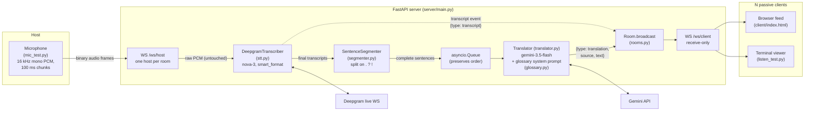

# Architecture — Live Sermon Translator

*Last updated: 2026-07-11 (after TTS removal)*

A text-only live translation pipeline: English speech goes in from one host, and
English transcripts plus Korean translations come out to any number of viewers.

> **Note:** `CLAUDE.md` describes a Gemini **Live API** speech-to-speech relay
> architecture (no STT stage, no segmenter, no separate translation call), but the
> actual code is the older pipeline architecture — Deepgram STT → sentence
> segmenter → Gemini text translation. The code and the project doc have diverged;
> this document describes the code.

## Big picture

One FastAPI server (`server/main.py`) sits in the middle. A single "host" (the
person at the preacher's microphone) streams raw audio to it over a WebSocket.
The server transcribes that audio with Deepgram, cuts the transcript into
sentences, translates each sentence into Korean with Gemini, and broadcasts both
the English and the Korean as JSON messages to every connected client in the same
room. Clients are purely passive — they open a WebSocket, receive text, and
render it.

## Diagram



ASCII fallback:

```
 Host mic (mic_test.py)
   16 kHz mono 16-bit PCM, 100 ms chunks
        │  binary WS frames
        ▼
 ┌─────────────────────────── FastAPI server ────────────────────────────┐
 │  /ws/host ──► DeepgramTranscriber ──► final ──► SentenceSegmenter     │
 │   (1 per        (stt.py, nova-3)     transcripts   (. ? ! boundaries) │
 │    room)             │                                  │             │
 │                      │ {type: transcript}               ▼             │
 │                      │                            asyncio.Queue       │
 │                      │                                  │ (in order)  │
 │                      │                                  ▼             │
 │                      │                       Translator (gemini-3.5-  │
 │                      │                       flash + glossary prompt) │
 │                      │                                  │             │
 │                      ▼                                  ▼             │
 │                 Room.broadcast ◄──── {type: translation, source, text}│
 │                      │                                                │
 │                      ▼                                                │
 │                 /ws/client (receive-only, N connections)              │
 └───────────────────────────────┬────────────────────────────────────--┘
                                 │ JSON
              ┌──────────────────┴──────────────────┐
              ▼                                     ▼
    Browser feed (client/index.html)     Terminal viewer (listen_test.py)
    EN line + KO line per sentence       prints [EN] / [KO]
```

## The pipeline, step by step

### 1. Audio capture (host side)

The stand-in host app is `mic_test.py`. It opens the microphone via
`sounddevice` at 16 kHz mono 16-bit PCM, in 100 ms chunks (1,600 frames), and
sends each chunk as a binary WebSocket message to
`ws://server/ws/host?room=NAME`. There is no real browser host app yet — this
script plays that role.

### 2. Host connection (`/ws/host` in `server/main.py`)

When a host connects, the server looks up or creates the named `Room` and
enforces the one-host rule: if the room already has a host, the new connection
is rejected with close code 4409. Otherwise it builds a `HostSession`, which
wires together the three processing stages, starts the Deepgram connection, and
spawns a background `translation_worker` task. From then on the endpoint is a
simple loop: receive an audio chunk from the host, forward it to Deepgram
untouched.

### 3. Speech-to-text (`server/stt.py`)

`DeepgramTranscriber` holds one live Deepgram WebSocket per host session,
configured for the `nova-3` model, US English, `linear16` encoding at 16 kHz.
`smart_format` is on so Deepgram inserts punctuation (which the next stage
depends on), and `interim_results` is on so partial transcripts arrive too.
Every transcript event calls back into `HostSession.on_transcript(text,
is_final)`.

### 4. Sentence segmentation (`server/segmenter.py`)

Interim (non-final) transcripts are ignored — only finalized text moves forward.
Each final transcript is immediately broadcast to clients as a
`{"type": "transcript", "text": ...}` message, then fed to the
`SentenceSegmenter`, which accumulates text in a buffer and emits a sentence
every time it sees `.`, `?`, or `!`. Text after the last terminator stays
buffered until more arrives. This exists because Deepgram finalizes on pauses,
not sentence boundaries, and translation quality is much better on whole
sentences.

### 5. Translation (`server/translator.py` + `server/glossary.py`)

Completed sentences go onto an `asyncio.Queue`, and the single
`translation_worker` task pulls them off one at a time — the queue is what
guarantees translations reach clients in the order the sentences were spoken,
even though the Gemini calls are async.

Each sentence becomes one `generate_content` call to `gemini-3.5-flash` with
thinking disabled and temperature 0.2 (both for latency/consistency). The system
instruction is built by `build_translation_instruction()` and encodes the domain
knowledge:

- simultaneous-interpreter role
- reverent 합쇼체 sermon register
- standard Korean Bible book names for verse references
  (John 3:16 → 요한복음 3장 16절)
- reproduce 개역개정 wording for quoted Bible verses
- a 22-term glossary (grace → 은혜, gospel → 복음, …)

On a 429 rate limit the translator retries up to 4 times, honoring the
server-suggested delay if the error message contains one, otherwise doubling a
1-second backoff. A sentence whose translation fails after retries is logged and
skipped, not retried forever — the worker moves on so the live feed doesn't
stall.

### 6. Broadcast (`server/rooms.py`)

Each translation is broadcast as
`{"type": "translation", "source": "<english>", "text": "<korean>"}`.
`Room.broadcast` sends the JSON to every client socket and silently drops any
that error (dead connections). `RoomManager` deletes a room once it has no host
and no clients.

### 7. Client display (`client/index.html`, served at `/`)

The browser client connects to `/ws/client?room=NAME` (room from the URL query
string, default `main`) and just renders what arrives. A `transcript` message
appends a feed entry showing the English with a grey "번역 중…" (translating…)
placeholder underneath; the entry is pushed onto a `pending` FIFO. When the
matching `translation` message arrives, the oldest pending entry gets its Korean
text filled in.

Since the TTS removal there is no audio, so the page loads straight into the
feed — no click-to-enable overlay, no mute button. If the socket drops, it shows
"reconnecting…", clears the pending queue, and retries every 2 seconds.

There's also `listen_test.py`, a terminal version of the same client that prints
`[EN]`/`[KO]` lines.

## WebSocket message types

| Direction        | Type          | Payload                                   |
| ---------------- | ------------- | ----------------------------------------- |
| host → server    | (binary)      | raw 16 kHz mono 16-bit PCM, ~100 ms/frame |
| server → clients | `transcript`  | `{"type": "transcript", "text": en}`      |
| server → clients | `translation` | `{"type": "translation", "source": en, "text": ko}` |

## Lifecycle and edge cases

- When the host disconnects, `HostSession.close()` flushes any incomplete
  sentence still in the segmenter buffer into the queue (so trailing words get
  translated), enqueues a `None` sentinel that tells the translation worker to
  exit, closes the Deepgram connection, and the endpoint waits for the worker to
  drain the queue before cleaning up the room.
- The `Translator` is a lazily-created singleton shared across host sessions;
  the Deepgram connection is per-session.
- Client sockets are receive-only — the server reads from them solely to detect
  disconnects.

## Configuration and running

Secrets live in `.env`:

| Variable           | Status                                                    |
| ------------------ | --------------------------------------------------------- |
| `GEMINI_API_KEY`   | required — host connection fails without it               |
| `DEEPGRAM_API_KEY` | required — read when a host connects                      |
| `OPENAI_API_KEY`   | unused (leftover from removed TTS)                        |
| `TTS_SPEED`        | unused (leftover from removed TTS)                        |

Run:

```bash
uvicorn server.main:app --reload   # server + client page at http://127.0.0.1:8000/
python mic_test.py                 # stand-in host (speak English)
python listen_test.py              # optional terminal viewer
pytest                             # 15 tests: segmenter, glossary, rooms, translator retry
ruff check .                       # lint
```

`GET /health` is a liveness check. Tests cover the pure logic only — no live API
calls.
