# Architecture — Live Sermon Translator

*Last updated: 2026-07-11 (Gemini TTS added, aligned by sentence id; 개역개정
verse references annotated on translations)*

A live translation pipeline: English speech goes in from one host, and English
transcripts, Korean translations, and Korean TTS audio come out to any number
of viewers — all three aligned per sentence.

> **Note:** `CLAUDE.md` describes a Gemini **Live API** speech-to-speech relay
> architecture (no STT stage, no segmenter, no separate translation call), but the
> actual code is the older pipeline architecture — Deepgram STT → sentence
> segmenter → Gemini text translation. The code and the project doc have diverged;
> this document describes the code.

## Big picture

One FastAPI server (`server/main.py`) sits in the middle. A single "host" (the
person at the preacher's microphone) streams raw audio to it over a WebSocket.
The server transcribes that audio with Deepgram, cuts the transcript into
sentences, translates each sentence into Korean with Gemini, synthesizes the
Korean into speech with Gemini TTS, and broadcasts all three as JSON messages to
every connected client in the same room. Clients are purely passive — they open
a WebSocket, receive text and audio, and render/play it.

**Alignment model:** the segmented sentence is the unit of everything. Each
sentence gets an incrementing `id` when it leaves the segmenter, and the
`transcript`, `translation`, and `tts` messages for that sentence all carry it,
so clients pair the three streams explicitly (the browser client highlights the
sentence whose audio is currently playing).

## Diagram

```mermaid
flowchart LR
    subgraph Host
        MIC["Browser host (client/host.html)<br/>AudioWorklet → 16 kHz mono PCM,<br/>100 ms chunks<br/>(or mic_test.py stand-in)"]
    end

    subgraph Server["FastAPI server (server/main.py)"]
        WSH["WS /ws/host<br/>one host per room"]
        STT["DeepgramTranscriber<br/>(stt.py)<br/>nova-3, smart_format"]
        SEG["SentenceSegmenter<br/>(segmenter.py)<br/>split on . ? !"]
        Q["asyncio.Queue<br/>(preserves order)"]
        TR["Translator (translator.py)<br/>gemini-3.1-flash-lite<br/>+ glossary system prompt<br/>(glossary.py)"]
        TTS["Synthesizer (tts.py)<br/>Google Cloud TTS<br/>24 kHz PCM out"]
        ROOM["Room.broadcast<br/>(rooms.py)"]
        WSC["WS /ws/client<br/>receive-only"]
    end

    subgraph Clients["N passive clients"]
        WEB["Browser feed + audio<br/>(client/index.html)"]
        CLI["Terminal viewer<br/>(listen_test.py)"]
    end

    MIC -- "binary audio frames" --> WSH
    WSH -- "raw PCM (untouched)" --> STT
    STT -- "final transcripts" --> SEG
    SEG -- "sentences (each gets an id)<br/>{type: transcript, id}" --> Q
    SEG -.-> ROOM
    Q --> TR
    TR -- "{type: translation,<br/>id, source, text}" --> ROOM
    TR -- "Korean text" --> TTS
    TTS -- "{type: tts, id,<br/>rate, audio b64}" --> ROOM
    ROOM --> WSC
    WSC --> WEB
    WSC --> CLI

    STT <--> DG["Deepgram live WS"]
    TR <--> GM["Gemini API"]
    TTS <--> CT["Cloud TTS REST"]
```



ASCII fallback:

```
 Host mic (client/host.html, or mic_test.py stand-in)
   16 kHz mono 16-bit PCM, 100 ms chunks
        │  binary WS frames
        ▼
 ┌─────────────────────────── FastAPI server ────────────────────────────┐
 │  /ws/host ──► DeepgramTranscriber ──► final ──► SentenceSegmenter     │
 │   (1 per        (stt.py, nova-3)     transcripts   (. ? ! boundaries) │
 │    room)                                                │             │
 │                     {type: transcript, id}              ▼ (id, text)  │
 │                      ┌──────────────────────────  asyncio.Queue       │
 │                      │                                  │ (in order)  │
 │                      │                                  ▼             │
 │                      │                       Translator (gemini-3.1-  │
 │                      │                       flash-lite + glossary)   │
 │                      │   {type: translation, id, ...}   │ Korean text │
 │                      │  ┌───────────────────────────────┤             │
 │                      │  │                               ▼             │
 │                      │  │                    Synthesizer (Google      │
 │                      │  │                    Cloud TTS, Chirp3-HD)    │
 │                      ▼  ▼                               │             │
 │                 Room.broadcast ◄──── {type: tts, id, rate, audio b64} │
 │                      │                                                │
 │                      ▼                                                │
 │                 /ws/client (receive-only, N connections)              │
 └───────────────────────────────┬────────────────────────────────────--┘
                                 │ JSON
              ┌──────────────────┴──────────────────┐
              ▼                                     ▼
    Browser feed (client/index.html)     Terminal viewer (listen_test.py)
    EN + KO per sentence, plays TTS      prints [EN] / [KO] / [TTS]
```

## The pipeline, step by step

### 1. Audio capture (host side)

The host app is `client/host.html`, served at `/host.html`. A start/stop
button opens the microphone with `getUserMedia`, and an AudioWorklet
downsamples the capture from the browser's native rate to 16 kHz mono 16-bit
PCM by linear interpolation (carrying the fractional read position across
blocks so there are no seams), posting one 100 ms chunk (1,600 frames) at a
time. Each chunk goes out as a binary WebSocket message to
`ws://server/ws/host?room=NAME` (room from the `?room=` query, default
`main`). The page shows a live level meter, retries the connection every 2 s
if it drops mid-broadcast (chunks produced while disconnected are dropped),
and reports the 4409 "room already has a host" rejection instead of
reconnecting. It also opens a second, receive-only `/ws/client` socket as a
text-only pipeline monitor so the operator can confirm transcripts and
translations are flowing — it never plays TTS audio.

There is also `mic_test.py`, a terminal stand-in host that captures via
`sounddevice` at 16 kHz directly and streams the same binary format.

### 2. Host connection (`/ws/host` in `server/main.py`)

When a host connects, the server looks up or creates the named `Room` and
enforces the one-host rule: if the room already has a host, the new connection
is rejected with close code 4409. Otherwise it builds a `HostSession`, which
wires together the three processing stages, starts the Deepgram connection, and
spawns a background `translation_worker` task. From then on the endpoint is a
simple loop: receive an audio chunk from the host, forward it to Deepgram
untouched.

### 3. Speech-to-text (`server/stt.py`)

`DeepgramTranscriber` holds one live Deepgram WebSocket per host session,
configured for the `nova-3` model, US English, `linear16` encoding at 16 kHz.
`smart_format` is on so Deepgram inserts punctuation (which the next stage
depends on), and `interim_results` is on so partial transcripts arrive too.
Every transcript event calls back into `HostSession.on_transcript(text,
is_final)`.

### 4. Sentence segmentation (`server/segmenter.py`)

Interim (non-final) transcripts are ignored — only finalized text moves forward.
Each final transcript is fed to the `SentenceSegmenter`, which accumulates text
in a buffer and emits a sentence every time it sees `.`, `?`, or `!` (subject to
a minimum length that merges very short utterances). Text after the last
terminator stays buffered until more arrives. This exists because Deepgram
finalizes on pauses, not sentence boundaries, and translation quality is much
better on whole sentences.

Each emitted sentence is assigned an incrementing id, broadcast to clients as
`{"type": "transcript", "id": n, "text": ...}`, and put on the queue as
`(id, sentence)`. That id is the alignment key carried by every downstream
message about the sentence.

### 5. Translation (`server/translator.py` + `server/glossary.py`)

Completed sentences go onto an `asyncio.Queue`, and the single
`translation_worker` task pulls them off one at a time — the queue is what
guarantees translations (and their audio) reach clients in the order the
sentences were spoken, even though the Gemini calls are async.

Each sentence becomes one `generate_content` call to `gemini-3.1-flash-lite` with
thinking disabled and temperature 0.2 (both for latency/consistency). The system
instruction is built by `build_translation_instruction()` and encodes the domain
knowledge:

- simultaneous-interpreter role
- reverent 합쇼체 sermon register
- standard Korean Bible book names for verse references
  (John 3:16 → 요한복음 3장 16절)
- reproduce 개역개정 wording for quoted Bible verses
- a 22-term glossary (grace → 은혜, gospel → 복음, …)

**Verse annotation:** when the model reproduces a 개역개정 verse and is
confident of the reference, it appends a marker line (`@ref 요한복음 3:16`)
after the translation. `parse_translation()` strips any `@ref` line from the
text and keeps it as the reference only if it contains a digit (so junk like
`@ref none` is discarded). `translate()` therefore returns a
`Translation(text, reference)` named tuple; the reference rides along on the
`translation` message (`"reference": null` when absent), is shown as a small
badge next to the Korean text in the browser client, printed as `〔…〕` by
`listen_test.py`, and is never sent to TTS. The model also wraps the verse
portion of the text — and only that portion — in `“ ”` quotation marks, so a
sentence mixing the speaker's words with a verse comes out as
`이제 6절입니다. “그들이 모였을 때에 …”`. If a response carries a reference but
no quotation marks, `parse_translation()` wraps the whole text as a fallback.
Clients render `text` verbatim; the worker strips `“ ”` from the TTS input so
the quotes are never spoken.

Retries (shared with TTS via `server/retry.py`): on a 429 or transient 5xx the
call retries up to 4 times, honoring the server-suggested delay if the error
message contains one, otherwise doubling a 1-second backoff. A sentence whose
translation fails after retries is logged and skipped, not retried forever —
the worker moves on so the live feed doesn't stall.

### 6. Text-to-speech (`server/tts.py`)

After broadcasting a translation, the same worker synthesizes the Korean text
with Google Cloud Text-to-Speech (REST `text:synthesize`, keyed by
`GOOGLE_CLOUD_TTS_KEY`). Voice defaults to `ko-KR-Chirp3-HD-Charon` (override with
`TTS_VOICE`; the `languageCode` is derived from the voice name) and
`speakingRate` defaults to 1.2 (override with `TTS_SPEED`, 1.0 = natural) —
fast delivery keeps the audio from drifting behind the live speaker. Cloud TTS
returns LINEAR16 in a WAV container; the server strips the header and
broadcasts raw 24 kHz 16-bit mono PCM, base64-encoded as
`{"type": "tts", "id": n, "rate": 24000, "audio": ...}`.

Ordering is inherited from the serial worker — sentence N's audio is always
produced after N−1's. The translation text is broadcast *before* synthesis
starts, so text latency doesn't pay the TTS cost; a synthesis failure (same
retry policy) costs only that one sentence's audio, never its text.

### 7. Broadcast (`server/rooms.py`)

`Room.broadcast` sends each JSON message to every client socket and silently
drops any that error (dead connections). `RoomManager` deletes a room once it
has no host and no clients.

### 8. Client display + playback (`client/index.html`, served at `/`)

The browser client connects to `/ws/client?room=NAME` (room from the URL query
string, default `main`) and renders what arrives. A `transcript` message appends
a feed entry (English + grey "번역 중…" placeholder) keyed by its `id` in an
`entries` map; the matching `translation` fills in the Korean by id — no FIFO
guesswork, so a dropped message can't desync later pairs.

Audio: browsers require a user gesture before playback, so the page opens with
a "오디오 켜기" overlay that creates the `AudioContext`; a 🔊/🔇 header button
mutes via a gain node. Each `tts` message is decoded (base64 → Int16 → Float32
`AudioBuffer` at the message's sample rate) and scheduled at a running cursor so
clips play back-to-back without overlapping — if audio arrives faster than it
plays, the schedule simply extends. While a clip plays, the entry with its id
gets a `speaking` highlight. TTS arriving before audio is enabled is dropped
(text still renders). If the socket drops, the client shows "reconnecting…" and
retries every 2 seconds.

There's also `listen_test.py`, a terminal version of the same client that prints
`[EN]`/`[KO]` lines and a `[TTS]` line with each clip's duration.

## WebSocket message types

| Direction        | Type          | Payload                                   |
| ---------------- | ------------- | ----------------------------------------- |
| host → server    | (binary)      | raw 16 kHz mono 16-bit PCM, ~100 ms/frame |
| server → clients | `transcript`  | `{"type": "transcript", "id": n, "text": en}` |
| server → clients | `translation` | `{"type": "translation", "id": n, "source": en, "text": ko, "reference": "요한복음 3:16" or null}` |
| server → clients | `tts`         | `{"type": "tts", "id": n, "rate": 24000, "audio": base64 PCM}` |

The `id` is per-host-session, incrementing from 0; all three messages for one
sentence share it.

## Lifecycle and edge cases

- When the host disconnects, `HostSession.close()` flushes any incomplete
  sentence still in the segmenter buffer into the queue (so trailing words get
  translated), enqueues a `None` sentinel that tells the translation worker to
  exit, closes the Deepgram connection, and the endpoint waits for the worker to
  drain the queue before cleaning up the room.
- The `Translator` and `Synthesizer` are lazily-created singletons shared
  across host sessions; the Deepgram connection is per-session.
- Client sockets are receive-only — the server reads from them solely to detect
  disconnects.

## Configuration and running

Secrets live in `.env`:

| Variable           | Status                                                    |
| ------------------ | --------------------------------------------------------- |
| `GEMINI_API_KEY`      | required — translation                                 |
| `GOOGLE_CLOUD_TTS_KEY`| required — TTS; host connection fails without it       |
| `DEEPGRAM_API_KEY`    | required — read when a host connects                   |
| `TTS_VOICE`           | optional — default `ko-KR-Chirp3-HD-Charon`            |
| `TTS_SPEED`           | optional — `speakingRate`, default `1.2`               |
| `OPENAI_API_KEY`      | unused (leftover from the old OpenAI TTS)              |

Run:

```bash
uvicorn server.main:app --reload   # server + client page at http://127.0.0.1:8000/
                                   # host page at http://127.0.0.1:8000/host.html
python mic_test.py                 # terminal stand-in host (speak English)
python listen_test.py              # optional terminal viewer
python tts_test.py [text]          # TTS-only smoke test (synthesizes + plays one sentence)
pytest                             # 26 tests: segmenter, glossary, rooms, translator, tts
ruff check .                       # lint
```

`GET /health` is a liveness check. Tests cover the pure logic only — no live API
calls.
